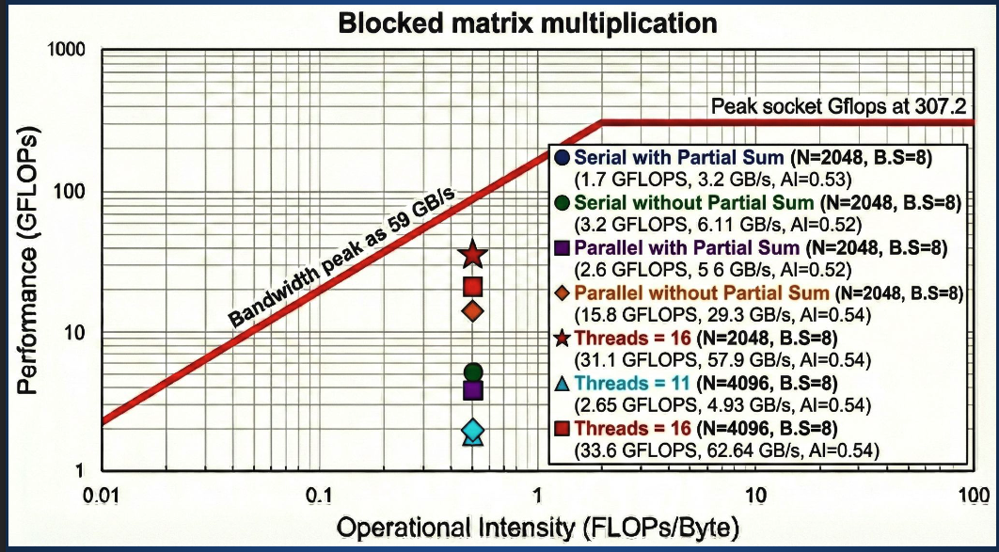
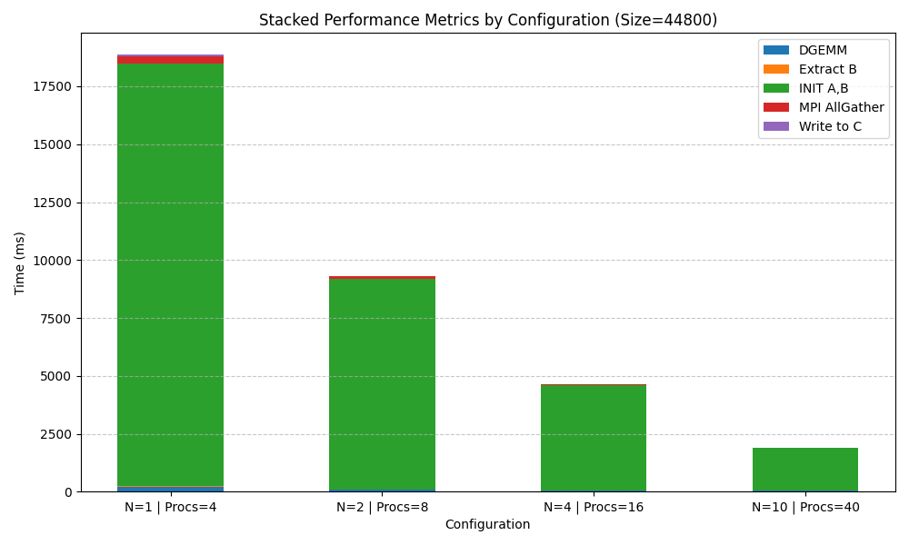

# matrix-multiplication-parallel

The same dense matrix multiply, four ways — hand-tiled for cache, distributed with Cannon's algorithm,
scaled with MPI+OpenMP over OpenBLAS, and pushed onto GPUs with cuBLAS. GEMM is the one kernel where
you can actually reach hardware peak, so it's the honest way to find out what each parallel model
gives you.

| Implementation | Method | Where the multiply happens |
|---|---|---|
| [`blocked-openmp/`](blocked-openmp/) | Hand-written cache tiling, OpenMP | Your own loops — and a roofline showing what that costs |
| [`cannon-mpi/`](cannon-mpi/) | Cannon's algorithm on a 2-D Cartesian torus | `cblas_dgemm` per tile, `MPI_Sendrecv_replace` to shift |
| [`hybrid-mpi-openmp/`](hybrid-mpi-openmp/) | Row-block decomposition + `MPI_Allgather` | `cblas_dgemm`, OpenBLAS multithreaded |
| [`multi-gpu-cublas/`](multi-gpu-cublas/) | One GPU per rank, MPI across | `cublasDgemm` on device |

**What the runs showed**

- **45 TFLOP/s on 16 nodes** at N = 224,000 — 22.5 PFLOP of work in 499 seconds.
- **Hand-written tiling is memory-bound and stays there.** Every configuration sits at arithmetic
  intensity ≈ 0.53 FLOP/byte, far left of the ridge point, so it rides the bandwidth roof at
  **33.6 GFLOP/s against a 307 GFLOP/s compute peak**.
- **A vendor BLAS is not a small win over your own loops.** It's the difference between the bandwidth
  roof and the compute roof.
- **Communication overtakes compute past 8 nodes.** `MPI_Allgather` grows from ~28% to ~60% of runtime.
- **A partial-sum accumulator made the parallel version 6× slower** — 2.6 GFLOP/s against 15.8.

**Stack:** C · C++20 · MPI · OpenMP · OpenBLAS · cuBLAS · CUDA · SLURM

**Where it ran:** Leonardo at CINECA — DCGP for CPU runs (112 cores/node, 2× Intel Sapphire Rapids),
Booster for GPU runs (4× A100 64 GB/node).

## The record run

| | |
|---|---:|
| Matrix | N = 224,000 (double precision) |
| Work | 2N³ = **22.48 PFLOP** |
| Resources | 16 nodes, 128 MPI ranks × 14 OpenMP threads = 1792 cores |
| Wall clock | 16:47:37 → 16:56:02 = 505 s |
| Accounted time | 499 s |
| **Sustained** | **45 TFLOP/s** |

| Phase | Max time | Share |
|---|---:|---:|
| `MPI_Allgather` | 281.2 s | 56% |
| DGEMM | 217.1 s | 44% |
| Init A,B | 5.5 s | — |
| Write C | 0.45 s | <1% |
| Extract B | 0.14 s | <1% |

→ **More than half the time is communication, not arithmetic.** At this size each rank needs the whole
of B, so the Allgather moves more data than the DGEMM reads. A 2-D decomposition — which is exactly
what [`cannon-mpi/`](cannon-mpi/) does — is the structural answer.

Raw output in [`hybrid-mpi-openmp/results/benchmark.txt`](hybrid-mpi-openmp/results/benchmark.txt).

## Roofline — why hand-tiling has a ceiling



| | |
|---|---:|
| Compute peak (socket) | 307.2 GFLOP/s |
| Bandwidth peak | 59 GB/s |
| Ridge point | ≈ 5.2 FLOP/byte |
| Measured arithmetic intensity | **0.52 – 0.54 FLOP/byte** |

Every measured point lands two orders of magnitude left of the ridge. That places the kernel in the
bandwidth-limited region, where the ceiling is `AI × bandwidth ≈ 31 GFLOP/s` — not the 307 GFLOP/s the
hardware can do.

| Configuration | GFLOP/s | GB/s |
|---|---:|---:|
| Serial, with partial sum | 1.7 | 3.2 |
| Serial, without partial sum | 3.2 | 6.1 |
| Parallel, with partial sum | 2.6 | 5.6 |
| Parallel, without partial sum | 15.8 | 29.3 |
| 16 threads, N = 2048 | 31.1 | 57.9 |
| **16 threads, N = 4096** | **33.6** | **62.6** |

→ **33.6 GFLOP/s against a 31 GFLOP/s bandwidth roof — the tiled version is at its ceiling.** Nothing
more is available without raising arithmetic intensity, which is precisely what a tuned BLAS does with
register blocking and packing.

→ **The partial-sum variant is 6× slower in parallel.** Accumulating into a shared partial sum
serialises what should be independent work; dropping it took 2.6 GFLOP/s to 15.8.

More plots — block-size sweep, thread scaling, strong and weak scaling — in
[`blocked-openmp/benchmarks/`](blocked-openmp/benchmarks/), and the write-up in
[`docs/blocked-gemm-presentation.pdf`](docs/blocked-gemm-presentation.pdf).

## Cannon's algorithm

A 2-D systolic decomposition. Ranks form a Cartesian torus, each owns one tile of A, B and C, and the
tiles shift by one position between multiply steps.

| Step | Call |
|---|---|
| Build the torus | `MPI_Cart_create` with periodic dims |
| Find neighbours | `MPI_Cart_shift` in both directions |
| Initial skew | `MPI_Sendrecv_replace` on A and B |
| Multiply | `cblas_dgemm` on the local tile |
| Shift and repeat | `MPI_Sendrecv_replace`, √P times |

- No rank ever holds a full matrix — memory per rank is O(N²/P), not O(N²)
- Communication is nearest-neighbour, so it doesn't degrade the way an all-to-all does
- **Requires a perfect-square rank count**

Measured on 4 ranks: DGEMM 10.6 s, shifts 210 ms average, init 112 ms — **communication under 2% of
runtime**, against 56% for the Allgather approach at scale. Details in
[`cannon-mpi/results/statistics.txt`](cannon-mpi/results/statistics.txt).

## Multi-GPU with cuBLAS

One GPU per MPI rank, `cudaSetDevice` by local rank, matrices resident on device, `cublasDgemm` for the
local multiply.



Three variants were profiled and are in [`multi-gpu-cublas/results/`](multi-gpu-cublas/results/):

| Variant | What it isolates |
|---|---|
| `perf_analysis_identity.png` | Identity matrices — cache- and branch-friendly input |
| `perf_analysis_rand_items.png` | Random data — realistic |
| `perf_analysis_no_sync.png` | Without device synchronisation between phases |

The `no_sync` case matters: without `cudaDeviceSynchronize`, kernel launches return immediately and the
timer measures the launch, not the work. It's included because getting that wrong is the most common
way GPU benchmarks end up wrong.

## Caveats

| Caveat | Detail |
|---|---|
| **The N = 22,400 sweep is unreliable** | Several rows in [`combined.dat`](hybrid-mpi-openmp/results/combined.dat) imply >50 TFLOP/s on a single node, which is above hardware peak. Runs that failed or exited early. Use the plot for the qualitative DGEMM-vs-Allgather trend; don't derive throughput from those rows |
| **The 45 TFLOP/s run is verified** | Wall-clock stamps in `benchmark.txt` (505 s) agree with the summed phase times (499 s), and 2N³/t reproduces 45 TFLOP/s |
| **Cannon's was only run at 4 ranks** | Enough to show the communication profile, not enough to call it a scaling study |
| **Different implementations, different problem sizes** | Not directly comparable across sections |
| **`mat_mult_hybrid_gpus` was a misnomer** | That course directory duplicated the CPU version despite the name. The real GPU code is the cuBLAS one here |

## Build and run

**Blocked, OpenMP**

```bash
gcc -O3 -march=native -fopenmp -o blocked.x blocked-openmp/src/blocked_gemm.c -lm
OMP_NUM_THREADS=16 ./blocked.x
```

**Cannon's** — needs a perfect-square rank count

```bash
mpicxx -std=c++20 -O3 -march=native -Icannon-mpi/include \
  cannon-mpi/src/main.cpp -lopenblas -fopenmp -o cannon.x
mpirun -n 4 ./cannon.x
```

**Hybrid MPI + OpenMP**

```bash
mpic++ -std=c++20 -O3 -march=native -Ihybrid-mpi-openmp/include -fopenmp \
  hybrid-mpi-openmp/src/main.cpp -lopenblas -o hybrid.x
OMP_NUM_THREADS=14 mpirun -n 128 ./hybrid.x
```

**Multi-GPU cuBLAS**

```bash
nvcc -std=c++17 -O3 -Imulti-gpu-cublas/include \
  multi-gpu-cublas/src/main.cpp -lcublas -lmpi -o gpu.x
mpirun -n 4 ./gpu.x
```

SLURM scripts are in each variant's `slurm/`. Set `OMP_PROC_BIND=close`, `OMP_PLACES=cores` and
`OPENBLAS_NUM_THREADS` to match `OMP_NUM_THREADS`.

## Layout

```
blocked-openmp/      hand-tiled GEMM in C + 7 benchmark plots incl. roofline
cannon-mpi/          Cannon's algorithm on a Cartesian torus
hybrid-mpi-openmp/   row-block + Allgather, the 45 TFLOP/s run
multi-gpu-cublas/    one GPU per rank, cublasDgemm
docs/                blocked-GEMM write-up
```

Each variant shares three headers: `CMatrix.hpp` (storage and the multiply), `parallel_2.hpp`
(decomposition), `parallel_timer.hpp` (per-rank timing reduced across ranks).

## Where this came from

| | |
|---|---|
| Course | *P1.5 Parallel Programming* and *P1.7 GPU Programming*, MHPC, ICTP / SISSA Trieste, 2025–26 |
| Cluster | Leonardo, CINECA |
| Public since June 2026 | [`prabhkodes/low_level_optimisations`](https://github.com/prabhkodes/low_level_optimisations), [`prabhkodes/open_mpi_openmp_stuff`](https://github.com/prabhkodes/open_mpi_openmp_stuff), [`prabhkodes/cuda_stuff`](https://github.com/prabhkodes/cuda_stuff) |
| Course repositories | Belong to SISSA, private |
